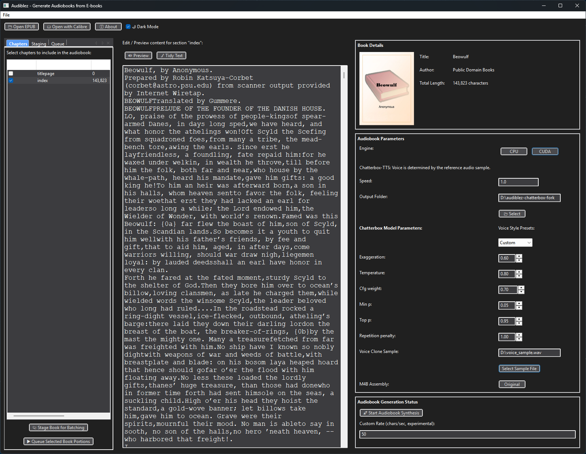

# Audiblez: Generate audiobooks from e-books

> **⚠️ Work in Progress**: This is a fork of [boilthesea/audiblez](https://github.com/boilthesea/audiblez) and is currently under active development. It has only been tested on Windows and may not work properly on other operating systems.

> **📝 Note**: Kokoro TTS has been fully removed from this fork. This version uses Chatterbox-TTS exclusively for speech synthesis.

Audiblez generates `.m4b` audiobooks from regular `.epub` e-books,
using Chatterbox-TTS for high-quality speech synthesis.


Chatterbox-TTS is a modern text-to-speech system supporting voice cloning and advanced model parameters for natural, expressive output.
It currently supports a wide range of languages and voices.




## How to install and run (Development Fork)

**⚠️ Important**: This fork is not available on PyPI. You must install from source.

### Prerequisites
- Python 3.9 to 3.12 (Python 3.13+ is not supported)
- Git
- `ffmpeg` and `espeak-ng` installed on your system

### Installation Steps

1. **Clone the repository:**
```bash
git clone https://github.com/Stoobs/audiblez-chatterbox.git
cd audiblez-chatterbox
```

2. **Install system dependencies:**
```bash
# Windows (using chocolatey or manual installation)
choco install ffmpeg
# Download and install espeak-ng from: https://github.com/espeak-ng/espeak-ng/releases

# Ubuntu/Debian (untested with this fork)
sudo apt install ffmpeg espeak-ng

# macOS (untested with this fork)
brew install ffmpeg espeak-ng
```

3. **Install Python dependencies:**
```bash
pip install -e .
```

### Basic Usage

Convert an epub to audiobook using default voice:
```bash
audiblez book.epub
```

The tool will create `book_chapter_1.wav`, `book_chapter_2.wav`, etc. files, and then combine them into a `book.m4b` audiobook file that you can play with VLC or any audiobook player.

### Voice Cloning (Optional)

To use a custom voice, provide an audio sample file:
```bash
audiblez book.epub --voice-sample path/to/voice_sample.wav
```

The voice sample should be a clear audio file (wav, mp3, etc.) of the voice you want to clone.

## How to run the GUI

The GUI is a simple graphical interface to use audiblez. After installing the main package as described above, you may need additional GUI dependencies:

```bash
# install GUI dependencies
pip install pillow wxpython

# Ubuntu/Debian (untested - may need additional packages)
sudo apt install libgtk-3-dev
pip install pillow wxpython

# macOS (untested)
pip install pillow wxpython
```

Then you can run the GUI with:
```bash
audiblez-ui
```

## Windows Installation (Recommended)

Since this fork has only been tested on Windows, here's the recommended Windows installation process:

1. **Open a Windows terminal (PowerShell or Command Prompt)**

2. **Clone and navigate to the project:**
```cmd
git clone https://github.com/Stoobs/audiblez-chatterbox.git
cd audiblez-chatterbox
```

3. **Create and activate a virtual environment:**
```cmd
python -m venv venv
.\venv\Scripts\Activate.ps1
```

4. **Install system dependencies:**
   - Install `ffmpeg`: Download from https://ffmpeg.org/download.html or use `choco install ffmpeg`
   - Install `espeak-ng`: Download from https://github.com/espeak-ng/espeak-ng/releases

5. **Install Python dependencies:**
```cmd
pip install -m requirements.txt
pip install .
```

6. **Run the application:**
```cmd
audiblez book.epub
# or for GUI
audiblez-ui
```

7. **For CUDA support (optional):**
   - Install PyTorch with CUDA support: https://pytorch.org/get-started/locally/
   - Use the `--cuda` flag when running audiblez


## Speed

By default the audio is generated using a normal speed, but you can make it up to twice slower or faster by specifying a speed argument between 0.5 to 2.0:

```bash
audiblez book.epub
```

You can also combine speed with voice cloning:

```bash
audiblez book.epub --voice-sample path/to/voice.wav
```

## Voice Cloning with Chatterbox-TTS

This fork uses **Chatterbox-TTS** for voice synthesis, which supports voice cloning from audio samples rather than predefined voice selections.

### How Voice Cloning Works

Instead of selecting from a predefined list of voices, you can clone any voice by providing an audio sample:

```bash
audiblez book.epub --voice-sample path/to/voice_sample.wav
```

### Voice Sample Requirements

- **Format**: WAV, MP3, or other common audio formats
- **Length**: 10-30 seconds of clear speech
- **Quality**: Clean audio with minimal background noise
- **Content**: Natural speech (not singing or shouting)
- **Language**: Should match the language of your text for best results

### Default Voice

If no `--voice-sample` is provided, Chatterbox-TTS will use its default voice synthesis.

For more information about Chatterbox-TTS capabilities, visit: [Chatterbox-TTS Repository](https://github.com/resemble-ai/chatterbox)

## How to run on GPU

By default, audiblez runs on CPU. If you pass the option `--cuda` it will try to use the Cuda device via Torch.

Check out this example: [Audiblez running on a Google Colab Notebook with Cuda ](https://colab.research.google.com/drive/164PQLowogprWQpRjKk33e-8IORAvqXKI?usp=sharing]).

We don't currently support Apple Silicon, as there is not yet a Chatterbox-TTS implementation in MLX. As soon as it will be available, we will support it.

## Manually pick chapters to convert

Sometimes you want to manually select which chapters/sections in the e-book to read out loud.
To do so, you can use `--pick` to interactively choose the chapters to convert (without running the GUI).


## Help page

For all the options available, you can check the help page `audiblez --help`:

```
usage: audiblez [-h] [-p] [-s SPEED] [-c] [-o FOLDER] [--voice-sample FILE] epub_file_path

positional arguments:
  epub_file_path        Path to the epub file

options:
  -h, --help            show this help message and exit
  -p, --pick            Interactively select which chapters to read in the audiobook
  -s SPEED, --speed SPEED
                        Set speed from 0.5 to 2.0 (default: 1.0)
  -c, --cuda            Use GPU via Cuda in Torch if available
  -o FOLDER, --output FOLDER
                        Output folder for the audiobook and temporary files
  --voice-sample FILE   Path to audio file for voice cloning (optional)

examples:
  audiblez book.epub --pick
  audiblez book.epub --speed 1.5 --voice-sample voice.wav
  audiblez book.epub --cuda --output ./audiobooks/

to run GUI:
  audiblez-ui

Note: Chatterbox-TTS uses audio prompt files for voice cloning.
Voice selection is handled through the GUI or audio prompt files.
```

## Author

Originally by [Claudio Santini](https://claudio.uk) in 2025, distributed under MIT licence.

This fork is maintained by [Stoobs](https://github.com/Stoobs) based on the work from [boilthesea/audiblez](https://github.com/boilthesea/audiblez).

Related Article: [Audiblez v4: Generate Audiobooks from E-books](https://claudio.uk/posts/audiblez-v4.html)
